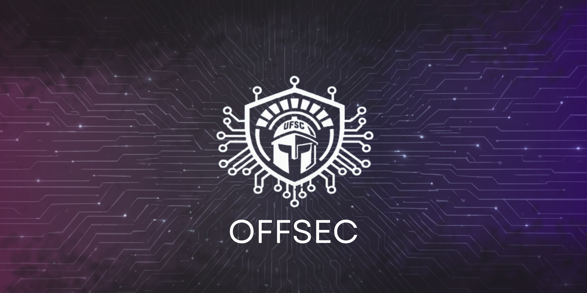

# UFSC - OFFSEC PwnBase



<div align="center">

  

</div>

## Sobre Nós

O **UFSC OFFSEC PwnBase** é uma iniciativa acadêmica do Grupo de Segurança Ofensiva (OFFSEC) da Universidade Federal de Santa Catarina (UFSC) focada no estudo, pesquisa e desenvolvimento de técnicas de segurança ofensiva e hacking ético. Este projeto visa capacitar participantes com conhecimentos práticos em cibersegurança, sempre seguindo princípios éticos e legais. A UFSC OFFSEC também visa transmitir conceitos e  conhecimentos úteis  relacionados à segurança em ambientes virtuais à sociedade civil.

O grupo trabalha com:

- Estudo de vulnerabilidades (CVEs)
- Desenvolvimento de exploits educacionais
- Criação de material didático
- Participação e Desenvolvimento de CTFs (Capture The Flag)


## Missão e Valores

###  Missão

Complementar a formação dos acadêmicos da **Universidade Federal de Santa Catarina**, promover o ensino e a pesquisa em segurança cibernética através de metodologias práticas e éticas, formando profissionais mais capacitados e transmitir conhecimento de qualidade para a sociedade civil.  

###  Valores

| Valor                | Descrição                                                                |
| -------------------- | ------------------------------------------------------------------------ |
| **Ética**            | Todas as atividades seguem padrões éticos e legais.                      |
| **Educação**         | Foco no aprendizado contínuo e no compartilhamento de conhecimento.      |
| **Inovação**         | Busca constante por novas técnicas e metodologias em segurança ofensiva. |
| **Colaboração**      | Trabalho em equipe e contribuição com a comunidade.                      |
| **Responsabilidade** | Uso consciente e responsável do conhecimento adquirido.                  |


## Membros

###  Coordenação


| Nome                                   | Função                | GitHub                                               |
| -------------------------------------- | --------------------- | ---------------------------------------------------- |
| 👨‍🏫 **Prof. Dr. Roberto Filho**      | Criador do OFFSEC| [@robertovrf](https://github.com/robertovrf)         |
| 👨‍🏫 **Prof. Dr. Martin A. G. Vigil** |Coordenador Geral | [@Gagliotti](https://github.com/gagliotti)           |
| 🧑‍💻 **Clara Marcela Grossl**         | Bolsista Responsável  | [@Clara-M-Grossl](https://github.com/Clara-M-Grossl) |

### Líderes de Projetos
| Nome | Projeto                     | GitHub |     
| ---- | --------------------------- | ------ |
|🧑‍💻 **Maurício Melo**        | Produção de CTF Externo     | [@mau25673](https://github.com/mau25673)          |   
|    🧑‍💻 **Isadora Orige Ribeiro Alves**   | Grupo de Visitas Guiadas    |      [@5ometh1ngWe1rd](https://github.com/5ometh1ngWe1rd)     |     
|  🧑‍💻 **Matheus Augusto Lima**       | Grupo de Cursos e Palestras |      [@cypherghostmd](https://github.com/cypherghostmd)   |     

###  Estudantes Graduandos

| Nome                                    | GitHub                                                    |
|-----------------------------------------|-----------------------------------------------------------|
| 🧑‍💻 **Adilson Vissoli**                  |  `@` *(não informado)*                                    |
| 🧑‍💻 **Arthur Bogoni**                    |  `@` *(não informado)*                                    |
| 🧑‍💻 **Bernardo de Souza Teixeira**       |  `@` *(não informado)*                                    |
| 🧑‍💻 **Heitor de Bona Garcia**            | `@` *(não informado)*                                     |
| 🧑‍💻 **Isadora Orige Ribeiro Alves**      | [@5ometh1ngWe1rd](https://github.com/5ometh1ngWe1rd)      |
| 🧑‍💻 **Luisa Scholtao Luna**              | `@` *(não informado)*                                     |
| 🧑‍💻 **Mario Jorge Delgado Rocha**        | `@` *(não informado)*                                     |
| 🧑‍💻 **Matheus Augusto Lima**             | [@cypherghostmd](https://github.com/cypherghostmd)        |
| 🧑‍💻 **Maurício Melo**                    | [@mau25673](https://github.com/mau25673)                  |
| 🧑‍💻 **Natalia Farias Bianchini**         | [@natfb](https://github.com/natfb)                        |
| 🧑‍💻 **Rafael Rodrigues Ribeiro Junior**  | [@RqfaelJr](https://github.com/RqfaelJr)                  |


### Histórico de Contribuidores
<details>
<summary>Espaço dedicado para as pessoas que fizeram parte dessa jornada até aqui</summary>
<br>
O OFFSEC agradece a todos os membros que dedicaram seu tempo e conhecimento para o crescimento deste projeto.

### Coordenação (Anterior)

| Nome                                   | Função                                      | GitHub                                               |
|----------------------------------------|---------------------------------------------|------------------------------------------------------|
| 🧑‍💻 **Gabriel Juliani Segatto**         | **Bolsista Responsável em 2025**            | [@GJSegatto](https://github.com/GJSegatto)           |


### Liderança de Projetos (Anterior)

| Nome                                   | Função                                      | GitHub                                               |
|----------------------------------------|---------------------------------------------|------------------------------------------------------|
| 🧑‍💻 **João Marcos Moço Giraldi**        | Grupo de Visitas Guiadas em 2025            | [@joao-giraldi](https://github.com/joao-giraldi)     |
| 🧑‍💻 **Nícolas Sanson Giaboeski**        | Grupo de Cursos e Palestras em 2025         | [@NicovrauG](https://github.com/NicovrauG)           |

### Colaboradores e Graduandos

| Nome                               | Função                        |  GitHub                                                    |
|-----------------------------------|--------------------------------|------------------------------------------------------------|
| 🧑‍💻 **Akamine Maia**               | Membro (2025)                  | `@` *(não informado)*                                      |
| 🧑‍💻 **Alec Coelho**                | Membro (2025)                  | `@` *(não informado)*                                     |
| 🧑‍💻 **Augusto Daleffe**            | Membro (2025)                  | [@Dleffe](https://github.com/Dleffe)                      |
| 🧑‍💻 **Davi de Carvalho Brigido Josino**|  Membro (2026)             | `@` *(não informado)*                                     |
| 🧑‍💻 **Derick Andrighetti**         | Membro (2025/2024)             | [@rideckszz](https://github.com/rideckszz)                |
| 🧑‍💻 **Eduardo Chedid**             | Membro (2025/2024)             | [@Getdit](https://github.com/Getdit)                      |
| 🧑‍💻 **Eduardo Panizzon**           |  Membro (2025)                 | [@EduardoPanizzon](https://github.com/EduardoPanizzon)    |
| 🧑‍💻 **Filipe de Moura Peixoto**    |  Membro (2026)                 | [@childrenoftheK0rn](https://github.com/childrenoftheK0rn)|
| 🧑‍💻 **Heitor Soares de Melo**      |  Membro (2026)                 | `@` *(não informado)*                                     |
| 🧑‍💻 **Italo Silva**                | Membro (2025/2024)             | [@ITA-LOW](https://github.com/ITA-LOW)                    |
| 🧑‍💻 **João Bacar Baldé**           |  Membro (2026)                 | `@` *(não informado)*                                     |
| 🧑‍💻 **Jurpinho Juca Soares**       |  Membro (2026)                 | `@` *(não informado)*                                     |
| 🧑‍💻 **Junhaum Hayden**             | Membro (2025)                  | [@JunhaumHayden](https://github.com/junhaumhayden)        |
| 🧑‍💻 **Junior Co**                  | Membro (2025)                  | `@` *(não informado)*                                     |
| 🧑‍💻 **Matheus Joaquim**            | Membro (2025)                  | `@` *(não informado)*                                     |
| 🧑‍💻 **Maurício Darabas**           | Membro (2025)                  | `@` *(não informado)*                                     |
| 🧑‍💻 **Messias dos Santos**         | Membro (2025)                  | `@` *(não informado)*                                     |
| 🧑‍💻 **Nícolas Sanson Giaboeski**   |  Membro (2025)                 | [@NicovrauG](https://github.com/NicovrauG)                |  
| 🧑‍💻 **Thomas Tavares Tomaz**       |  Membro (2026)                 | [@ThomasTavares](https://github.com/ThomasTavares)        |
| 🧑‍💻 **Valentina Ragnini**          | Membro (2025)                  | [@valentinaleiria](https://github.com/valentinaragnini)   |
| 🧑‍💻 **Valtair Leandro Neto**       |  Membro (2026)                 | [@ValtairLeandro](https://github.com/ValtairLeandro)      |
| 🧑‍💻 **Vitoria Alves**              | Membro (2025)                  | `@` *(não informado)*                                     |


</details>

## Projetos em Desenvolvimento

| Grupo                  | Descrição                                                                    |
| ---------------------- | ---------------------------------------------------------------------------- |
| **CTF Externo**        | Criação de desafios *Capture the Flag* autorais.                             |
| **Palestras e Cursos** | Produção de conteúdo educativo e contato com a comunidade externa.           |
| **Visitas Guiadas**    | Apresentação de cibersegurança a escolas, em parceria com o projeto da UFSC. |


##  Estrutura do Repositório

```
pwnbase/

├── 📂 assets/ # Projects resources
|
├── 📂 writeups/ # Resoluções de CTFs e desafios.
|
├── 📂 content/ # Trilhas de estudo e materiais didáticos.
|     |   
│     ├── 📂 [00] - Tools Setup /
|     |
|     ├── 📂 [01] - Fundamentals /
|     |
|     ├── 📂 [02] - Enumeration /
|     |
|     ├── 📂 [03] - Exploitation /
|     |
|     ├── 📂 [04] - Web Attacks /
|     |
|     ├── 📂 [05] - Privilege Escalation /
|     |
|     ├── 📂 [06] - Useful Tools /
|
├── 📂 presentations/ # Apresentações, palestras e slides
```

---

## Repositórios Parceiros

Esse repositório também pode ser encontrado na base de conhecimento do projeto de extensão: [Repositórios Eng. Computação UFSC-ARA](https://github.com/repositorio-code).


## Contato

Se tiver interesse em entrar em contato com a gente, acesse nosso servidor no [Discord](https://discord.gg/m9txZqC3Ft).

<div  align="center">

**Desenvolvido pela equipe UFSC OFFSEC**

 

</div>
