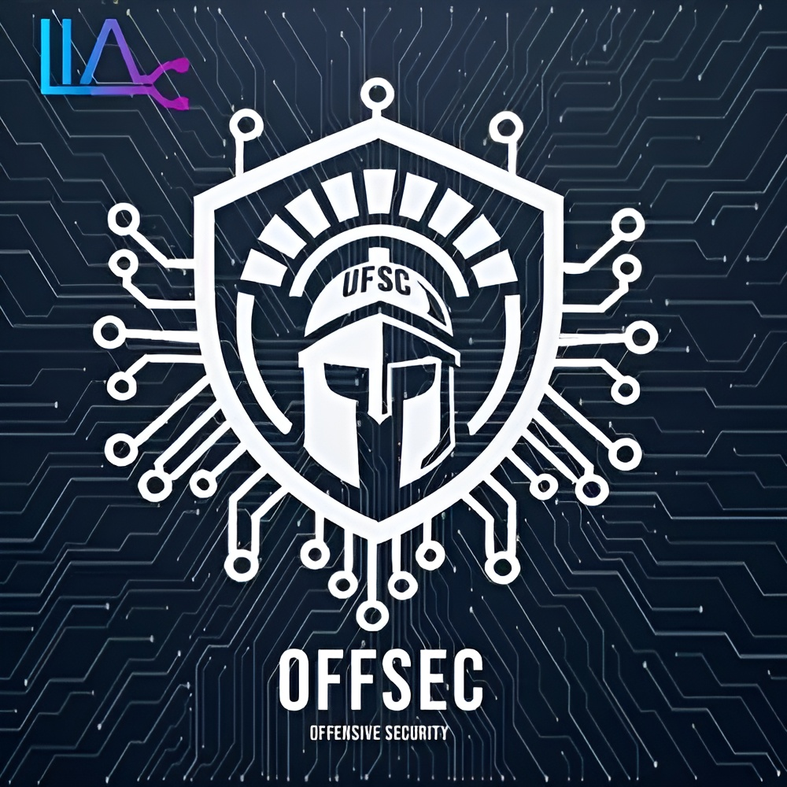

# UFSC - OFFSEC PwnBase

<div align="center">




</div>

## Sobre Nós

O **UFSC OFFSEC PwnBase** é uma iniciativa acadêmica do Grupo de Segurança Ofensiva (OFFSEC) da Universidade Federal de Santa Catarina (UFSC) focada no estudo, pesquisa e desenvolvimento de técnicas de segurança ofensiva e hacking ético. Este projeto visa capacitar participantes com conhecimentos práticos em cibersegurança, sempre seguindo princípios éticos e legais. A UFSC OFFSEC também visa transmitir conceitos e  conhecimentos úteis  relacionados à segurança em ambientes virtuais à sociedade civil.

O grupo trabalha com:

- 🔍 Estudo de vulnerabilidades (CVEs)
- 🔐 Desenvolvimento de exploits educacionais
- 📚 Criação de material didático
- 🏆 Participação e Desenvolvimento de CTFs (Capture The Flag)


## Missão e Valores

###  Missão

Complementar a formação dos acadêmicos da **Universidade Federal de Santa Catarina**, promover o ensino e a pesquisa em segurança cibernética através de metodologias práticas e éticas, formando profissionais mais capacitados e transmitir conhecimento de qualidade para a sociedade civil.  

###  Valores

| Valor           | Descrição                                                                 |
|-----------------|---------------------------------------------------------------------------|
| 🔒 **Ética**        | Todas as atividades seguem padrões éticos e legais.                      |
| 🎓 **Educação**     | Foco no aprendizado contínuo e no compartilhamento de conhecimento.     |
| 🚀 **Inovação**     | Busca constante por novas técnicas e metodologias em segurança ofensiva. |
| 🤝 **Colaboração**  | Trabalho em equipe e contribuição com a comunidade.                      |
| 🎯 **Responsabilidade** | Uso consciente e responsável do conhecimento adquirido.               |


## Membros

###  Coordenação


| Nome                                   | Função                     | GitHub                                               |
|----------------------------------------|----------------------------|------------------------------------------------------|
| 👨‍🏫 **Prof. Dr. Roberto Filho**         | Coordenador Geral          | [@robertovrf](https://github.com/robertovrf)         |
| 👨‍🏫 **Prof. Dr. Martin A. G. Vigil**    | Professor Responsável      | `@` *(não informado)*                                |
| 🧑‍💻 **Gabriel Juliani Segatto**         | Bolsista Responsável       | [@GJSegatto](https://github.com/GJSegatto)           |

###  Estudantes Graduandos

| Nome                          | GitHub                        |
|-------------------------------|-------------------------------|
| 🧑‍💻 **Alec Coelho**              | `@` *(não informado)*         |
| 🧑‍💻 **Augusto Daleffe**          | `@` *(não informado)*         |
| 🧑‍💻 **Clara Grossl**             | [@Clara-M-Grossl](https://github.com/Clara-M-Grossl)        |
| 🧑‍💻 **Derick Andrighetti**       | [@rideckszz](https://github.com/rideckszz)        |
| 🧑‍💻 **Eduardo Chedid Padilha Ribeiro**  | [@Getdit](https://github.com/Getdit) |
| 🧑‍💻 **Eduardo Panizzon**         | [@EduardoPanizzon](https://github.com/EduardoPanizzon)        |
| 🧑‍💻 **Felipe Matar**             | `@` *(não informado)*         |
| 🧑‍💻 **Gabriel Juliani Segatto**  | [@GJSegatto](https://github.com/GJSegatto) |
| 🧑‍💻 **Italo Silva**  | [@ITA-LOW](https://github.com/ITA-LOW) |
| 🧑‍💻 **João Marcos Moço Giraldi** | [@joao-giraldi](https://github.com/joao-giraldi) |
| 🧑‍💻 **José Victor Miranda**      | `@` *(não informado)*         |
| 🧑‍💻 **Junior Co**                | `@` *(não informado)*         |
| 🧑‍💻 **Matheus Augusto**          | `@` *(não informado)*         |
| 🧑‍💻 **Matheus Joaquim**          | `@` *(não informado)*         |
| 🧑‍💻 **Maurício Darabas**         | `@` *(não informado)*         |
| 🧑‍💻 **Maurício Melo**            | `@` *(não informado)*         |
| 🧑‍💻 **Nícolas Sanson Giaboeski** | [@NicovrauG](https://github.com/NicovrauG) |
| 🧑‍💻 **Thales Suarez**            | `@` *(não informado)*         |


## Projetos e Repositórios Relacionados

###  Repositórios Parceiros

Esse reposotório também pode ser encontrado na base de conhecimento do projeto de extensão [nome_projeto_jim] encontrado em [lik_repo_jim].  

###  Projetos em Desenvolvimento

| Grupo              | Descrição                                                                 |
|--------------------|---------------------------------------------------------------------------|
| 🎯 **CTF Externo**       | Criação de desafios *Capture the Flag* autorais.                         |
| 📚 **Palestras e Cursos** | Produção de conteúdo educativo e contato com a comunidade externa.       |
| 🏫 **Visitas Guiadas**    | Apresentação de cibersegurança a escolas, em parceria com o projeto da UFSC. |


##  📁 Estrutura do Repositório

```
pwnbase/

├── 📂 challenges/ # CTFs concluídos e Write-Ups

├── 📂 docs/ # Documentação e Materiais Didáticos

│ ├── 📂 classes/ # Materiais sobre assuntos estudados

│ ├── 📂 environment/ # Tutoriais de instalação e configuração do ambiente

│ └── 📂 get-started/ # Tutorial para os primeiros passos

├── 📂 presentations/ # Apresentações e slides
```

---

<div  align="center">

**Desenvolvido pela equipe UFSC OFFSEC**


</div>