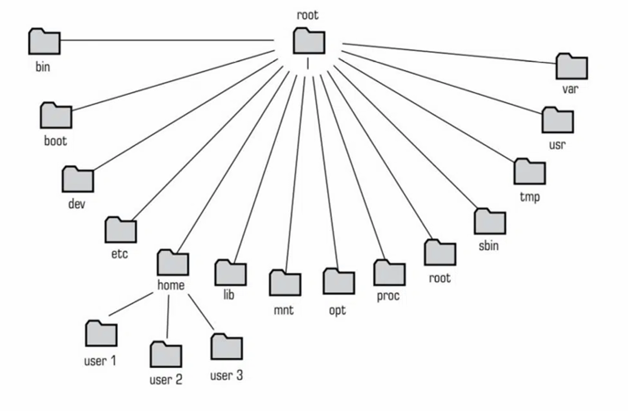

# Comandos Linux Básicos e SSH

➡️ [PDF da Aula](./pdf/linux1.pdf) desenvolvido por [@Getdit](https://github.com/Getdit)\
➡️ [PDF da Aula](./pdf/linux2.pdf) desenvolvido por [@NicovrauG](https://github.com/NicovrauG)

---

# Fundamentos do Sistema Operacional

Por que aprender Linux?
- 96,3% dos um milhão de servidores da web utilizam Linux.  
- 100% dos 500 supercomputadores mais rápidos do mundo rodam em Linux.  
- Base de conhecimento essencial para CTFs, pentests e administração de servidores.

---

## 📂 Estrutura de Diretórios

A organização do sistema de arquivos no Linux segue uma estrutura hierárquica chamada de FHS (Filesystem Hierarchy Standard), iniciando obrigatoriamente no diretório `/`. A ilustração abaixo representa essa disposição:

<div align="center">

</div>

Para fins de compreensão, apresentam-se os diretórios principais que compõem essa estrutura:

- `/`: é o diretório principal do sistema
- `/home`: diretórios destinados aos arquivos pessoais dos usuários comuns
- `/bin`: armazena os binários essenciais do sistema
- `/etc`: contém os arquivos de configuração do computador local
- `/tmp`: diretório designado para o armazenamento de arquivos temporários criados por programas 
- `/var`: logs e dados variáveis
- `/usr`: programas e bibliotecas de usuário

---

## Navegação e Gestão de Arquivos
A base de operação do sistema é o terminal, onde você digita comandos específicos para executar cada tarefa.

Diante disso, os principais comandos de navegação são:

| Comando | Função |
|---------|--------|
| `pwd` | Mostra diretório atual |
| `ls` | Lista os arquivos do diretório |
| `ls -a` | Lista arquivos incluindo ocultos (iniciam com `.`)|
| `ls -la` | Lista os arquivos de forma detalhada, inclusive os ocultos|
| `cd nome_pasta ` | Altera o diretório atual para um diretório especificado, permitindo a navegação entre as pastas |
| `cd ..` | Sobe um nível na hierarquia|
| `cd ../../outra_pasta` | Sobe e entra em outra pasta |
| `cd` | Volta ao diretório home |


Para fazer a gestão dos arquivos, utiliza-se os comandos abaixo:

| Comando | Função |
|---------|--------|
| `mkdir nome` | Cria diretório |
| `nano arquivo.txt` | Cria/edita o arquivo |
| `wget <url> -O nome` | Baixa o arquivo de um serviço web |
| `mv origem destino` | Move/renomeia o arquivo |
| `cat arquivo.txt` | Exibe o conteúdo do arquivo |
| `rm arquivo.txt` | Remove o arquivo |
| `rm -r pasta` | Remove a pasta e o conteúdo |

> [!WARNING]
> Nunca rode `rm -rf /`! Esse comando força a remoção recursiva de todos os diretórios a partir do início da hierarquia, apagando o sistema inteiro!

---

## 👤 Usuários e Grupos

A arquitetura do Linux gerencia o acesso através de controles de propriedade.

### Estrutura:

A utilização do sistema é dividida em usuários e grupos, para que o administrador do sistema possa ter um controle maior sobre quem irá acessá-lo

- Usuários: entidades que interagem com o sistema.  
- Grupos: conjuntos de usuários.
- Root: é o superusuário do sistema, consegue realizar qualquer operação no sistema, independente de permissões restritivas.

### Comandos úteis:

|Comando  | Função |
|---------|--------|
| `whoami` | Mostra o usuário atual|
| `groups` | Lista todos os grupos de segurança aos quais o seu usuário pertence     |
|`groups [user]`| Mostra os grupos de um usuário específico |
| `cat /etc/passwd` |Lista de usuários do sistema      |
|`sudo [comando]` | Executa uma instrução como root (geralmente exige a sua senha para confirmar a execução)|
|`su [usuario]` | Troca de usuário |

---

## 🔑 Permissões de Arquivos

As permissões são divididas afetando os arquivos de acordo com o usuário (criador), o grupo e todos os outros usuários.

- `r`: permite a leitura do arquivo (4).
- `w`: permite escrever no arquivo (2).
- `x`: permite executar o arquivo (1).
- `d`: identificação de diretório.

> Permissões seguem o formato: `drwxrwxr-x (0775)`

O Linux permite a atribuição de permissões de forma rápida e direta através de valores numéricos, dessa forma, cada privilégio possui um peso matemático específico. 

Para definir os níveis de acesso de um ficheiro, basta **somar** os valores correspondentes às permissões que se pretende liberar.

- 7: (4 + 2 + 1) => Controle total (Lê, escreve e executa);
- 6: (4 + 2 + 0) => Lê e escreve, mas não executa;
- 4: (4 + 0 + 0) => Apenas leitura;
- 0: (0 + 0 + 0) => Nenhum acesso permitido.

Ao utilizar o comando `chmod`, o sistema lê três números consecutivos, representando respectivamente o Proprietário, o Grupo e os Outros Utilizadores

```bash
chmod 750 script.sh

# 7 (Proprietário): Possui controle total (rwx)
# 5 (Grupo): Pode ler e executar (r-x)
# 0 (Outros): Os usuários restantes do sistema não têm nenhum acesso (---)
```

É possível alterar o dono de um arquivo ou suas permissões:

```bash
sudo chown user:group arquivo.txt       # Muda o usuário ao qual um arquivo pertence
sudo chmod 770 arquivo.txt              # Muda as permissões destinadas a um arquivo
```

Uma boa forma de praticar permissões de arquivos é através do [Chmod Calculator](https://chmod-calculator.com/).

---

## Tratamento de Dados no Terminal

O sistema Linux possibilita o encadeamento de comandos para o tratamento de resultados.

### Redirecionamento e Pipe

- Pipe `|`: Redireciona a saída de um comando para a entrada de outro comando.

  ```bash
  cat settings.txt | grep "config" | sort
  ```
- Redirecionamento `>` e `>>`: O `>` envia a saída de um comando para um arquivo designado, e o `>>` acrescenta a saída em um arquivo sem apagar os dados anteriores.

### Busca e Filtragem

- `grep`: Procura por palavras em arquivos ou dados de entrada e mostra as linhas encontradas
  ```bash
  grep -i "password" arquivo.txt
  grep -r "config" /etc

  # -i: ignora diferença entre maiúsculo e minúsculo
  # -r: busca recursivamente por uma palavra
  # -c: conta quantas vezes a palavra aparece no arquivo
  # -o: mostra somente a palavra buscada
  ```
- `strings`: Extrai texto de arquivos binários (útil para steganography).
- `diff`: Compara dois arquivos e devolve as diferenças entre eles.
  ```bash
  diff arquivo1.txt arquivo2.txt
  ```

---

## 📦 Gerenciamento de Pacotes (Debian/Ubuntu)

No Linux, a instalação de softwares não ocorre através de instaladores manuais avulsos. O sistema opera com base em repositórios centrais, que armazenam vários programas validados e seguros. O comando `apt` é o responsável por interagir com esses repositórios, automatizando a busca, a transferência e a resolução de dependências.

```bash
sudo apt update              # Atualiza a lista de pacotes
sudo apt upgrade             # Atualiza os pacotes instalados
sudo apt install <pacote>    # Instala o pacote
sudo apt remove <pacote>     # Remove o pacote
sudo apt purge <pacote>      # Remove o pacote com configs
```

---

## 🔐 SSH (Secure Shell)

O Secure Shell (SSH) é o protocolo padrão para a administração remota de sistemas. Diferente de outros protocolos, o SSH estabelece uma comunicação criptografada entre a máquina local e o servidor remoto. Isso garante que nenhum dado transmitido possa ser interceptado em texto plano por terceiros que estejam na rede.

### Métodos de Autenticação

O acesso ao servidor exige a validação de identidade, que pode ocorrer de duas formas:

- Credenciais Simples (Usuário e senha): vulnerável a ataques de força bruta;
- Chaves Criptográficas: O padrão da indústria para servidores e nuvem. Consiste na geração de um par de chaves (ssh-keygen). A chave pública é armazenada no servidor alvo, enquanto a chave privada fica exclusivamente na máquina de origem. O acesso só é liberado mediante a verificação entre as duas partes.

### Conexões
```bash
# Conexão padrão (conecta via SSH ao host remoto usando usuário e porta padrão (22))
ssh usuario@host

# Conexão especificando uma porta
ssh usuario@host -p 2222

# Conexão utilizando uma chave privada para autenticação (-i de Identity file)   
ssh -i id_rsa usuario@host 
```

### Transferência de Arquivos com SCP (Secure Copy)
O SCP opera utilizando a mesma infraestrutura e o mesmo canal criptografado do SSH para garantir a integridade da cópia de arquivos pela rede.

```bash
# Upload: copia um arquivo local para um diretório no host
scp arquivo.txt usuario@host:/destino

# Download: copia um arquivo do host remoto para o diretório local
scp usuario@host:/arquivo.txt /destino

#Recursivo: copia recursivamente uma pasta local para o host 
scp -R pasta/ usuario@host:/destino       
```
