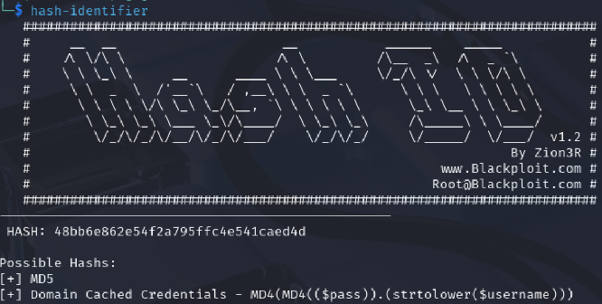

# Quebra de Hash com HashCat

➡️ [PDF da Aula](./pdf/hashcat.pdf) desenvolvido por [@ITA-LOW](https://github.com/ITA-LOW)

---

## 🧩 O que é um Hash?

Um **hash** é o resultado da aplicação de um algoritmo matemático a um dado de entrada, produzindo uma saída de tamanho fixo.

```yaml
Exemplo:
- Senha: `offsec123`  
- Algoritmo: SHA-1  
- Hash: `0d10f487c7c223bb68002832c69880d129222d47`
```
Hashes são funções unidirecionais, ou seja, não é possível "desfazer" o processo, mas técnicas de força bruta e dicionários podem encontrar a entrada original.

---

## 🔑 Principais Algoritmos de Hash

Existem inúmeros algoritmos e váriações que são utilizados para a cifragem de dados, mas alguns dos mais importantes são:

```yaml
- MD5: 128 bits (32 caracteres). Muito rápido, mas fraco contra ataques.  
- SHA-1: 160 bits (40 caracteres). Mais seguro que MD5, mas hoje considerado inseguro.  
- SHA-256: 256 bits (64 caracteres). Mais robusto, usado em criptografia moderna.  
- NTLM: Usado em sistemas Windows para armazenamento de senhas.
```

Hashes podem conter um valor adicional chamado *salt*, que é um dado aleatório adicionado à senha antes de gerar o hash. Isso impede ataques com tabelas pré-computadas e dificulta ataques de dicionário.

---

## 🎯 Casos de Uso

- **Auditoria de segurança**: verificar a força das senhas em um sistema.  
- **Recuperação de senhas esquecidas**: em ambientes corporativos ou pessoais.  
- **Identificação de vulnerabilidades de autenticação**: avaliando sistemas que armazenam hashes de forma insegura.

> [!CAUTION]
> Hashcat deve ser empregado apenas em ambientes de teste ou com autorização para auditoria.

---

## ⚖️ Vantagens e Desvantagens

| ✅ Vantagens                                                          | ❌ Desvantagens                                                              |
|-----------------------------------------------------------------------|-------------------------------------------------------------------------------|
| Suporta uma ampla variedade de algoritmos                             | Exige **hardware potente** (GPUs fazem grande diferença)                      |
| Vários modos de ataque: **força bruta, dicionário, máscara, híbrido** | O tempo de quebra cresce exponencialmente conforme a complexidade da senha    |
| Otimizado para CPU e GPU                                              | Maior complexidade de uso em comparação com ferramentas online                |

---

## Como identificamos o tipo de hash?

Para fazer a identificação da hash, usamos a ferramenta `hash-identifier` ou `hashid`. 

> [!IMPORTANT]
> Ferramentas como hash-identifier fornecem apenas possíveis tipos de hash. É comum que vários algoritmos tenham formatos semelhantes, sendo necessário testar diferentes opções no Hashcat.

<div align="center">

<p align="center"> Exemplo de uso da ferramenta.<b> </b></p>
</div>

---

## HashCat

O Hashcat é uma ferramenta usada para quebrar hashes de senhas, ou seja, tentar descobrir a senha original a partir de um valor criptografado. Ele faz isso testando várias combinações por segundo, usando a força do processador ou da placa de vídeo. Ele suporta vários tipos de hash e diferentes estratégias de ataque, como força bruta, dicionário e regras personalizadas.


### 💻 Exemplos de Uso

Antes de executar qualquer ataque, é recomendado visualizar as opções disponíveis da ferramenta:

```bash
hashcat -h
```

Esse comando exibe todos os algoritmos suportados (flag -m), modos de ataque (flag -a) e outras conficurações.


#### 1. Ataque de Dicionário


O ataque de dicionário consiste em testar uma lista de senhas conhecidas contra o hash.


```bash
hashcat -m 0 -a 0 hashes.txt wordlist.txt

# -m 0 → Algoritmo MD5
# -a 0 → Ataque de dicionário
# hashes.txt → Arquivo contendo hashes
# wordlist.txt → Lista de senhas para testar
```

##### Como funciona:

O Hashcat pega cada palavra da wordlist e aplica a função hash correspondente (MD5, neste caso). Em seguida, compara o resultado com os hashes fornecidos. Se houver correspondência, a senha original é descoberta.

##### Quando usar:

Esse é o método mais comum em CTFs, pois muitas senhas utilizadas são fracas ou já conhecidas.

---

#### 2. Ataque de Força Bruta

Nesse tipo de ataque, o Hashcat gera combinações automaticamente com base em um padrão definido pelo usuário.

```bash
hashcat -m 100 -a 3 hashes.txt ?a?a?a?a

# -m 100 → Algoritmo SHA1
# -a 3 → Ataque de força bruta
# hashes.txt → Arquivo contendo hashes
# ?a → Qualquer caractere (cada ?a é uma posição testada)
```

##### Como funciona:

O Hashcat gera todas as combinações possíveis para o padrão definido.
No exemplo acima, ele testa todas as combinações de 4 caracteres possíveis.

##### Tipos de máscaras:

- `?a`: Qualquer caractere;
- `?l`: Letras minúsculas;
- `?u`: Letras maiúsculas;
- `?d`: Números (0-9);
- `?s`: Símbolos;

##### Quando usar:

Esse ataque é útil quando você conhece o formato da senha, mas não sabe exatamente qual é.

---

#### 3. Ataque Híbrido (dicionário + máscara)


O ataque híbrido combina palavras de um dicionário com padrões adicionais.


```bash

hashcat -m 1000 -a 6 hashes.txt wordlist.txt ?d?d

# Testa cada palavra do dicionário adicionando dois dígitos ao final.
# -m 1000 → Algoritmo NTLM
# -a 6 → Ataque híbrido
# hashes.txt → Arquivo contendo hashes
# wordlist.txt → Lista de senhas para testar
# ?d → Dígito entre 0 e 9 (cada ?d é uma posição testada)

```
##### Quando usar:

Esse tipo de ataque é extremamente eficiente quando as senhas seguem padrões comuns, palavra + números etc.

---

#### 4. Ataque com Regras

Nesse modo, o Hashcat aplica modificações automáticas nas palavras do dicionário.

```bash
hashcat -m 0 -a 0 hashes.txt wordlist.txt -r rules/best64.rule

# -r rules/best64.rule  →  Aplica regras de trasnformação nas palavras

```

##### Como funciona:

O Hashcat modifica cada palavra da lista, gerando variações como:

- admin -> admin123
- admin -> adm1n
- admin -> Admin

Isso aumenta significativamente as chances de encontrar a senha correta.


