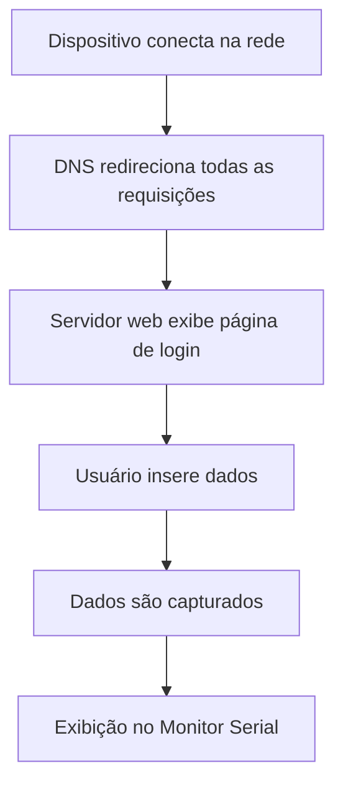

# 🎯 Portal Cativo Educacional - Demonstração de Phishing

<div align="center">


**⚠️ PROJETO EDUCACIONAL - USO APENAS PARA FINS DIDÁTICOS ⚠️**

</div>

---

## 📋 Sobre o Projeto

Este projeto demonstra como funciona um **Portal Cativo malicioso** utilizando um microcontrolador ESP32. O código cria um ponto de acesso Wi-Fi falso que simula uma rede de shopping ou estabelecimento comercial, coletando dados pessoais dos usuários que tentam se conectar.

### 🎯 Objetivos Educacionais

- Demonstrar como ataques de phishing via Wi-Fi funcionam
- Ensinar sobre os riscos de redes Wi-Fi públicas
- Mostrar técnicas de engenharia social em ambientes digitais
- Conscientizar sobre a importância da segurança em redes sem fio

---

## ⚡ Como Funciona

### 1. **Criação do Ponto de Acesso Falso**
O ESP32 cria uma rede Wi-Fi chamada `"Shopping Wi-Fi Gratuito"` que simula uma rede legítima de estabelecimento comercial.

### 2. **Redirecionamento DNS**
Qualquer tentativa de acesso à internet é redirecionada para uma página de login hospedada no próprio ESP32.

### 3. **Coleta de Dados**
A página de login solicita:
- CPF
- E-mail  
- Senha

### 4. **Armazenamento**
Os dados inseridos são capturados e exibidos no monitor serial do Arduino IDE.

---

## 🛠️ Requisitos do Sistema

### Hardware Necessário
- **ESP32** (qualquer modelo compatível)
- **Cabo USB** para programação
- **Computador** com Arduino IDE

### Software Necessário
- **Arduino IDE** (versão 1.8.0 ou superior)
- **Bibliotecas ESP32** instaladas no Arduino IDE

---

## 📦 Instalação e Configuração

### 1. **Configuração do Arduino IDE**

```bash
# 1. Adicionar URL das placas ESP32 nas Preferências:
https://dl.espressif.com/dl/package_esp32_index.json

# 2. Instalar as placas ESP32:
Ferramentas > Placa > Gerenciador de Placas > Pesquisar "ESP32" > Instalar
```

### 2. **Bibliotecas Necessárias**

As seguintes bibliotecas são necessárias (geralmente já incluídas no pacote ESP32):

```cpp
#include <WiFi.h>           // Controle Wi-Fi
#include <DNSServer.h>      // Servidor DNS
#include <WebServer.h>      // Servidor Web
```

### 3. **Upload do Código**

1. Conecte o ESP32 via USB
2. Selecione a placa correta em `Ferramentas > Placa`
3. Selecione a porta correta em `Ferramentas > Porta`
4. Faça o upload do código `portal_cativo.ino`

---

## 🚀 Como Utilizar

### 1. **Preparação**
```bash
# Abra o Monitor Serial (Ctrl+Shift+M)
# Velocidade: 115200 baud
```

### 2. **Execução**
1. Faça o upload do código para o ESP32
2. Abra o Monitor Serial para acompanhar o funcionamento
3. O ESP32 criará automaticamente a rede "Shopping Wi-Fi Gratuito"

### 3. **Teste (em dispositivo próprio)**
1. Conecte um dispositivo à rede criada
2. Tente acessar qualquer site
3. Será redirecionado para a página de login
4. Insira dados de teste
5. Observe a captura no Monitor Serial

### 4. **Monitoramento**
```
Exemplo de saída no Monitor Serial:
--------------------
CPF: 123.456.789-00
Email: teste@exemplo.com
Senha: minhasenha123
--------------------
```

---

## ⚙️ Configurações Personalizáveis

### Nome da Rede Wi-Fi
```cpp
const char* ssid = "Shopping Wi-Fi Gratuito";
// Altere para simular outros estabelecimentos
```

### Porta DNS
```cpp
const byte DNS_PORT = 53;
// Porta padrão do DNS, geralmente não precisa alterar
```

### Interface Web
O HTML/CSS da página pode ser modificado na variável `loginPage` para:
- Alterar aparência visual
- Modificar campos solicitados
- Personalizar logotipos e cores

---

## 🔍 Análise Técnica

### Fluxo de Funcionamento



---

## 🛡️ Aspectos de Segurança

### Como se Proteger

✅ **Boas Práticas:**
- Verifique sempre o nome exato da rede Wi-Fi
- Desconfie de redes que solicitam dados pessoais
- Use VPN em redes públicas
- Prefira dados móveis quando possível
- Verifique certificados SSL dos sites

❌ **Sinais de Alerta:**
- Redes com nomes genéricos ("Wi-Fi Gratuito", "Internet Grátis")
- Solicitação de CPF/dados pessoais para acesso
- Páginas sem HTTPS (cadeado)
- Redirecionamentos automáticos suspeitos

---

## ⚠️ Aviso Legal e Ético

### 🚨 **IMPORTANTE:**

Este projeto é destinado **EXCLUSIVAMENTE** para:
- ✅ Educação e conscientização em segurança
- ✅ Testes em redes próprias
- ✅ Demonstrações controladas
- ✅ Pesquisa acadêmica

### 🚫 **PROIBIDO:**
- ❌ Uso contra terceiros sem autorização
- ❌ Coleta não autorizada de dados pessoais
- ❌ Atividades maliciosas ou criminosas
- ❌ Violação de leis de proteção de dados

### 📋 **Responsabilidade Legal:**
O usuário é totalmente responsável pelo uso deste código. Os desenvolvedores não se responsabilizam por uso inadequado ou ilegal.

---

## 🔧 Solução de Problemas

### Problemas Comuns

**ESP32 não conecta:**
```bash
# Verifique se a placa ESP32 está selecionada corretamente
# Teste diferentes portas USB
# Pressione o botão BOOT durante o upload se necessário
```

**Rede Wi-Fi não aparece:**
```bash
# Verifique o Monitor Serial para mensagens de erro
# Reinicie o ESP32
# Verifique se não há conflito com outras redes próximas
```

**Página não carrega:**
```bash
# Verifique se o IP do ESP32 está sendo exibido no Serial
# Tente acessar diretamente pelo IP: http://192.168.4.1
```

## 📚 Referências e Recursos

- [Documentação oficial ESP32](https://docs.espressif.com/projects/esp-idf/en/latest/)
- [Arduino IDE para ESP32](https://github.com/espressif/arduino-esp32)
- [Conceitos de Portal Cativo](https://en.wikipedia.org/wiki/Captive_portal)
- [OWASP - Atques](https://owasp.org/www-community/attacks/)

---

<div align="center">

**Desenvolvido para fins educacionais pela equipe UFSC OFFSEC**


</div>
